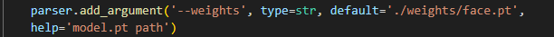

# 基于 YOLOV5s 的人脸识别数据集制作脚本

## 1.Introduction
本脚本基于 YOLOV5s 模型，用于制作人脸识别数据集。  
本项目起源于前不久需要做一个人脸识别的大作业，由于种种原因，没有使用网络上开源的人脸识别数据集，而是自己使用爬虫从网络上爬取了少量图片，并截出人脸部分制作成数据集。  
事实上，上述工作完全可以通过本脚本完成，解放双手，节约时间。


## 2.Run in terminal
``` 
    python detect_face.py  # 检测图片中的人脸，并将人脸部分截取出来
```

## 3.Project structure

`inference`  
&nbsp;&nbsp;&nbsp;&nbsp;&nbsp;&nbsp;&nbsp;&nbsp;    - `input`        -- 用于 test 的 image 或者 video  
&nbsp;&nbsp;&nbsp;&nbsp;&nbsp;&nbsp;&nbsp;&nbsp;    - `output`       -- 运行结果保存目录   
`utils`              -- 关键函数  
`weights`            -- 模型权重文件  
`yolov5_ultralytics` -- yolov5s模型  
`detect_face.py`     -- 基于YOLOV5s的人脸检测  
 

## How to run
### 1.preparations  
(1) 下载weights文件，`weights/weights.txt` (或者使用别人训练好的人脸检测权重)，注意权重的名称与路径要与下图保持一致   
  
(2) 制作需要截取人脸的文件夹，注意文件夹的结构如下图所示，根文件夹中放入子文件夹，各个子文件夹中放入需要截取人脸的图片  
  
(3) 修改代码中根文件夹的路径，默认保存在相同文件夹下，并自动替换原图片，因此请注意将原数据集备份

## Inferences 
https://github.com/ultralytics/yolov5 


## TODO
由于时间紧迫，本脚本还有许多不足之处，欢迎各位提出意见！  


